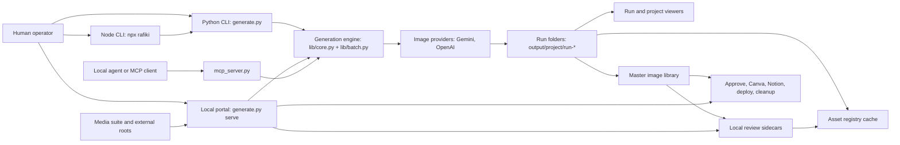
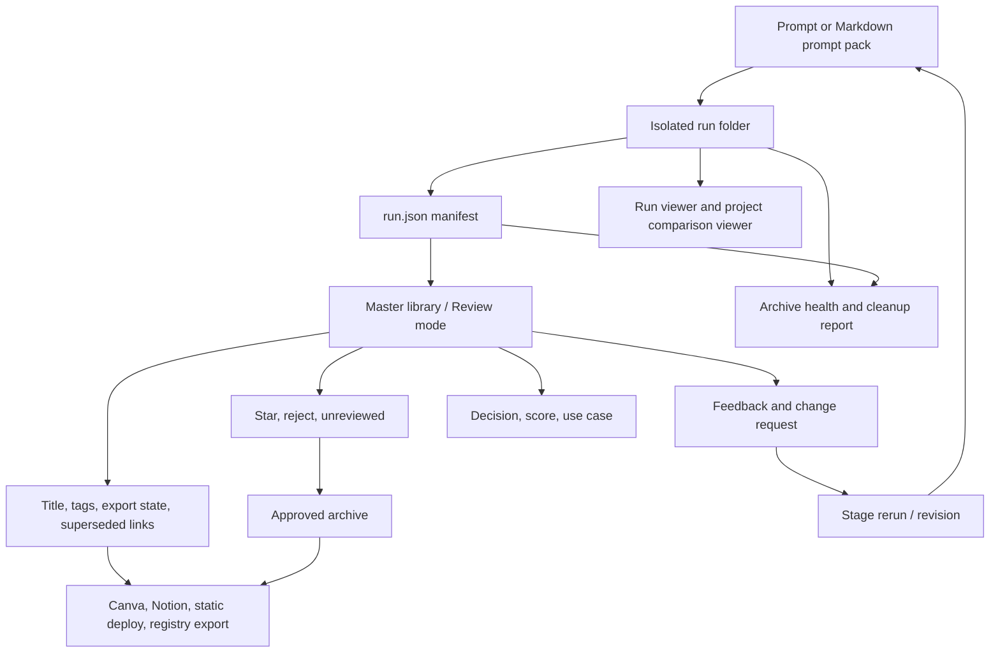
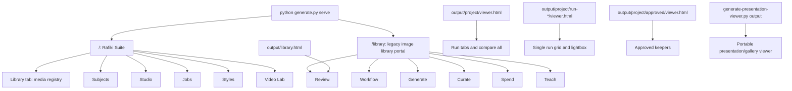
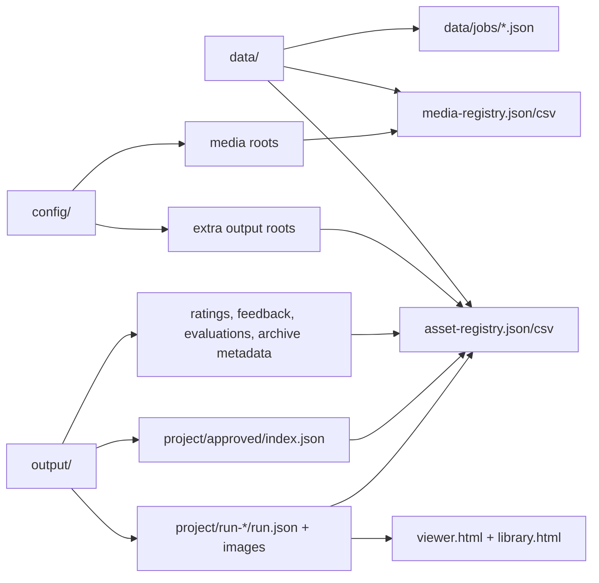
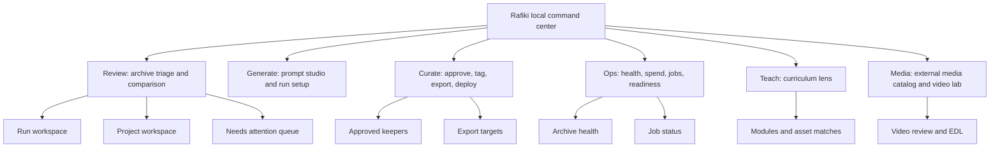

# Rafiki Library And Viewer Designer Handoff

Prepared: 2026-07-01

This is a designer-facing map of Rafiki's current image library, viewer, archive,
portal, registry, and media-suite system. It is intentionally not a refactor
ticket. The goal is to make the current system understandable enough that a
designer can rework the experience without needing to read the codebase first.

## Executive Read

Rafiki started as a local-first image generation workflow and grew into a
creative operations command center. Today it can generate images, keep isolated
batch runs, browse those runs, rate and approve outputs, export keepers, inspect
spend, teach from a curriculum atlas, and index external image/video/audio
roots. Those capabilities are useful, but the interface has accreted around
implementation surfaces rather than a clear product model.

The most important design problem: "library" currently means several things at
once:

- a static `output/library.html` file;
- a live `/library` image portal served by `python generate.py serve`;
- a registry/cache concept in `data/asset-registry.json`;
- an archive of every `output/<project>/run-*` image;
- a review queue, approval layer, metadata editor, and export staging area.

The redesign should keep the local-first, no-cloud-by-default boundary, but
give humans a clearer way to move from "what did we make?" to "what is worth
using?" to "where is this going next?"

## Current Inventory Snapshot

This snapshot was refreshed from the local checkout before writing this handoff.
Generated media, registry caches, and state files are local and gitignored, so
these counts describe this machine, not the public package.

| Area | Current state |
| --- | --- |
| Local output root | `output/` is about 4.3 GB. |
| Projects | 167 projects reported by archive health. |
| Runs | 214 manifest runs. |
| Manifest image records | 2,106 image records in `run.json` manifests. |
| Present images | 1,567 manifest images are present on disk. |
| Missing image records | 539 manifest image records point to missing files. |
| Failed images | 270 image records are failed outputs. |
| Image files on disk | 2,311 image files found by archive health. |
| Duplicate filename groups | 474 groups, usually reruns or repeated slots. |
| Cleanup risk items | 549 advisory risk items. |
| Malformed run folders | 8 run folders with missing/malformed manifests. |
| Ratings | 18 ratings: 8 starred, 10 rejected. |
| Durable feedback/evaluation/metadata | `feedback.json`, `evaluations.json`, and `archive-metadata.json` are currently absent in this local output root. |
| Approved archives | 3 projects have `approved/index.json`: `bcai-creative-site-kit-heroes-v2`, `dave-bakeoff`, and `dave-olson-momo`. |
| Registry cache | `data/asset-registry.json` has 1,203 entries: 109 approved and 1,094 unapproved/latest-run. |
| Media registry | `data/media-registry.json` has 308 entries: 150 images, 142 videos, and 16 audio files. |

High-volume local projects include `cmvan-generated-slides`,
`ethos-block-party-tracks`, `rap-week-1`, `ethos-block-party-covers`,
`kk-articles`, `futureproof-original-style-regeneration-pro`,
`aefl-futureproof-brand-bakeoff-2026`, `bcai-creative-site-kit-rest-v2`,
`rap-cohort-feature-graphics-2026`, and `mac-launch`.

The key product implication is that the archive is much larger and messier than
the curated layer. A redesigned library cannot assume clean albums. It needs to
support triage, comparison, missing-file awareness, and lightweight curation.

## System Map

### What This Means In Plain English

- The filesystem is the source of truth. Rafiki does not use a hosted database.
- A generation run writes a new `output/<project>/run-*` directory with images,
  `run.json`, and viewer HTML.
- The master library scans run folders and registry metadata to show a complete
  local archive.
- Ratings, feedback, evaluations, and archive metadata are separate local
  sidecars layered over immutable run outputs.
- Exports and deploys are explicit actions. Rafiki should never publish or
  delete generated work without a deliberate operator action.

## Asset Lifecycle

The design opportunity is to make this lifecycle visible without making the UI
feel like a filesystem debugger. A card should answer: what is this, where did
it come from, what is its status, and what should happen next?

## Current UI Surface Map

### Surface Summary

| Surface | Current purpose | Design risk |
| --- | --- | --- |
| `/` Rafiki Suite | Combined media command center for local media roots, subjects, jobs, styles, video, and dry-run studio actions. | It looks like a separate app from the image library and uses different interaction patterns. |
| `/library` live image library | Rich image archive with review, generate, curate, spend, teach, detail panel, and sidecar writes. | It carries too many modes and mixes review with operational/admin actions. |
| `output/library.html` | Static, file-openable master image library. | Static mode cannot write server-side state; localStorage fallback can confuse state ownership. |
| `output/<project>/viewer.html` | Project comparison viewer across runs. | Useful for reruns, but separate from the richer library review model. |
| `output/<project>/run-*/viewer.html` | Single run review page. | Lightweight, but shares visual language with the master library only loosely. |
| `output/<project>/approved/viewer.html` | Approved keeper set. | Important curation destination, but only three local projects currently use it. |
| Presentation viewer | JSON-driven deck/gallery viewer with self-contained export mode. | Another gallery pattern with its own UX assumptions. |

## State And Data Map

### Contracts A Redesign Must Preserve

These contracts are not changing in this doc pass, but the redesign must respect
them.

| Contract | Purpose |
| --- | --- |
| `output/<project>/run-*/run.json` | Canonical generated-run manifest: images, prompts, model, style, aspect ratio, timing, state, source. |
| `output/ratings.json` | Star/reject state keyed by archive card identity. |
| `output/feedback.json` | Per-card notes, review status, and change requests. |
| `output/evaluations.json` | Per-card decision, score, use case, rationale, and next step. |
| `output/archive-metadata.json` | Title overrides, tags, export/publish states, superseded links, and artifact provenance fields. |
| `output/<project>/approved/index.json` | Approved-image archive mapping back to source runs and original files. |
| `data/asset-registry.json` | Local searchable cache for generated/approved image assets. |
| `data/media-registry.json` | Local searchable cache for indexed image, video, and audio roots. |
| `/api/ratings` | Read/write ratings from the live portal. |
| `/api/feedback` | Read/write per-card feedback from the live portal. |
| `/api/evaluations` | Read/write per-card evaluation state. |
| `/api/archive-metadata` | Read/write card metadata and export/publish state. |
| `/api/regen` | Launch or dry-run Prompt Studio generation through the same batch path as the CLI. |
| `/api/media*` | Search, serve, select, annotate, and import/export indexed multimedia records. |

## Current Workflows

### Generate

Generation can start from:

- `npx rafiki` or `node index.js`;
- `python generate.py`;
- Prompt Studio in the live `/library` portal;
- MCP tools such as `rafiki_generate` and `rafiki_batch`.

All roads should end in an isolated `output/<project>/run-*` folder. That is a
good invariant. The weak spot is discoverability: a user can generate from many
surfaces, but the UI does not always make clear which surface is canonical.

### Review

Review currently happens in several layers:

- run viewer for one run;
- project viewer for comparing runs;
- master library Review mode for cross-project archive triage;
- media suite Library tab for indexed external media;
- lightbox views inside each surface.

This is powerful but cognitively expensive. The redesigned experience should
make "review this run", "compare reruns", "triage all archive work", and
"browse external media" feel related but distinct.

### Curate And Export

Curation signals include star/reject ratings, approved archives, metadata
states, feedback, evaluations, and export stamps. In the current local archive,
ratings exist but durable feedback/evaluation/metadata sidecars are absent, and
only three projects have approved archives. The interface therefore needs to
help users start curation quickly, not merely display curation after it exists.

Export actions include:

- approve starred images into `approved/`;
- export Canva bundles;
- run Notion dry-runs/exports;
- export registry CSV/JSON;
- deploy static viewers;
- inspect archive health and cleanup risk.

### Teach

Teach mode reads `config/curriculum-atlas.json` and matches archive assets to
programs/modules. It is a valuable specialist workflow, but it currently lives
beside core review controls. The redesign should decide whether Teach is a
top-level zone, a lens over Review, or a separate workspace.

### Media And Video

The root `/` suite indexes local media roots without copying files. It supports
image/video/audio cards, subjects, style records, job manifests, video
selections, notes, and EDL import/export. It is adjacent to the image archive,
but not identical. The design should treat it as a broader media catalog that
can share navigation and card language with the image library.

## Plain Redesign Pain Points

1. The word "library" is overloaded.

   Users need clearer names for archive, review queue, media catalog, approved
   keepers, and generated viewers.

2. The live image library is doing too much.

   Review, workflow staging, generation, export actions, spend accounting,
   curriculum teaching, metadata editing, feedback, evaluations, lineage, and
   prompt reruns all live in one generated HTML surface.

3. Static mode and server mode have different powers.

   A file-opened `library.html` can render and use localStorage, but cannot
   safely write the canonical sidecar files. The live portal can write sidecars
   and launch jobs. The UI needs to make this distinction obvious.

4. The archive is messy by nature.

   Missing images, failed outputs, duplicate filenames, malformed runs, and
   sparse approvals are not edge cases. They are part of the daily archive
   experience.

5. Curation state is fragmented.

   Ratings, feedback, evaluations, metadata, approvals, exports, and registry
   state are separate files and concepts. The user needs one visible "status"
   story per asset.

6. The same card can mean different things.

   A card might be a generated image, an approved copy, an external media file,
   a video clip, an audio file, a training output, or a curriculum-matched
   artifact. The current visual system does not always explain the type and
   action model.

7. Engineering templates have outgrown their shape.

   `lib/renderers/library.py` is over 3,000 lines and mixes data normalization,
   HTML, CSS, and client JavaScript. `lib/renderers/viewer.py` is over 1,100
   lines and carries another static viewer pattern. This matters for design
   because small UX changes currently require editing giant string templates.

8. The approval layer is thin.

   The local archive has thousands of generated records but only 109 approved
   registry entries. The design should optimize for discovering and promoting
   keepers, not only browsing already-curated work.

## Suggested Future Information Architecture

This is not a final navigation decision. It is a clean starting model: separate
the user's intent from the implementation surface.

## Design Requirements

- Keep Review image-first. The primary object is the visual output, not the
  manifest.
- Show status as a unified story: generated, missing/failed, rated, evaluated,
  approved, exported, published, superseded, or needs attention.
- Make project/run hierarchy legible. Users should know whether they are
  looking at one run, one project, all projects, an approved set, or external
  media.
- Make static versus live mode unmistakable. A read-only static viewer should
  not pretend it can do live portal work.
- Treat missing files and duplicate names as first-class archive states.
- Preserve prompt provenance without flooding the card grid with long text.
- Put destructive or external actions behind explicit confirmation and clear
  destination language.
- Reuse a common card/detail/lightbox language across images, videos, approved
  assets, and external media where possible.
- Give curation a fast path: keyboard review, bulk approve candidates, filters
  for "needs attention", and clear next actions.
- Keep local-first trust visible: paths, roots, generated folders, and state
  files matter, but they should appear in detail panels and ops views rather
  than crowding every card.

## Designer Questions To Resolve

- What should the main noun be: Archive, Library, Review, Media, or something
  else?
- Should `/` become the single command center for everything, with `/library`
  retired as a route, or should image review and media catalog stay separate?
- Is Teach a top-level workspace or a lens/filter inside Review?
- What is the right default: latest useful work, review queue, all-runs archive,
  or project picker?
- How should Rafiki represent generated images that are missing, failed,
  external, approved copies, or superseded variants?
- What card density best supports real archive triage: compact contact sheet,
  medium cards, or a split grid/detail workspace?
- Which actions belong directly on cards, and which belong only in detail,
  batch, or export flows?

## Implementation Notes For Later

This handoff does not change public APIs or data contracts. A future
implementation pass will likely need to separate concerns currently bundled
inside renderer templates:

- data collection and normalization;
- route/page composition;
- shared design tokens and components;
- client state and server API calls;
- static-export behavior versus live-portal behavior;
- accessibility and browser smoke coverage.

The redesign can be ambitious, but the first engineering slice should stay
surgical: preserve local filesystem contracts, keep generated outputs untouched,
and add tests around any changed review, state, or export behavior.
